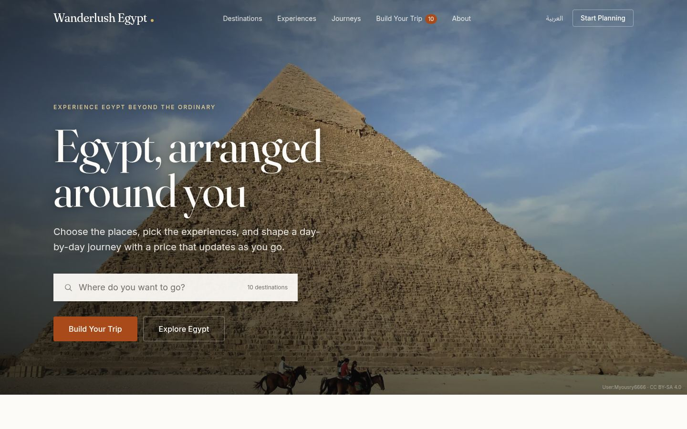
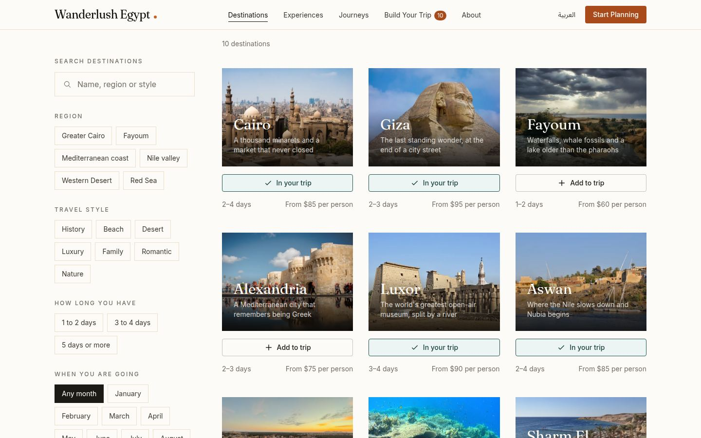
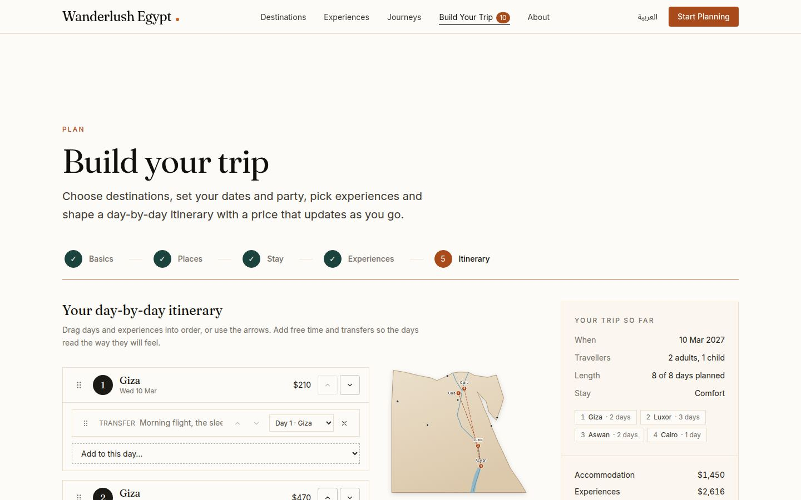
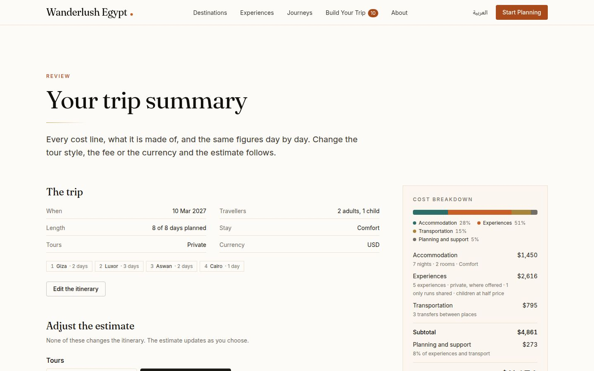
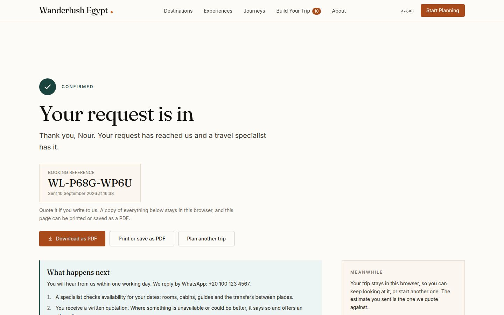
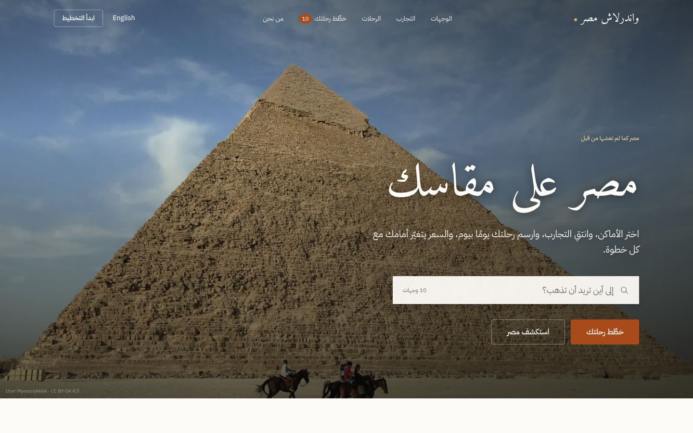
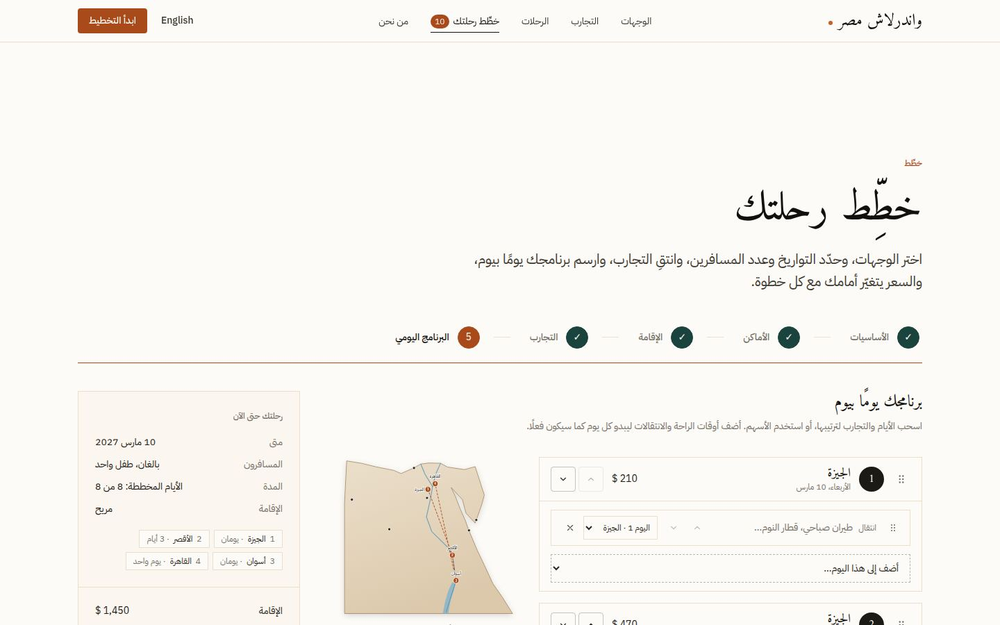

# Wanderlush Egypt

A bilingual travel discovery and trip-building site for a fictional premium
Egyptian travel company. Visitors explore ten destinations and twenty-seven
experiences, pick places and put nights to them, arrange a day-by-day
itinerary, watch a transparent estimate move with every change, and send a
booking request that comes back with a reference. English and Arabic are both
written natively, right to left included, and the whole trip can be taken
away as a PDF.

**Live:** https://wanderlush-egypt.vercel.app · **Arabic:** https://wanderlush-egypt.vercel.app/?lng=ar

> A portfolio project. Every destination, experience, price and testimonial is
> demonstration content, and the company does not exist. Designed and built by
> [Ibrahim Hassan](https://portfolio-ih18.vercel.app/).



## What it does

- **Discovery.** A cinematic homepage, an interactive SVG map of Egypt that
  drives a spotlight, guides for every destination with galleries and
  seasons, and an experiences marketplace with search, seven filter groups
  and four sort orders, all held in the URL so a view can be shared.
- **Trip builder.** Five steps that are really one editable thing: dates and
  party, places and nights (with the transfer between each pair spelled
  out), a stay level priced for the actual route, experiences ranked by the
  traveller's interests, and a day-by-day itinerary with drag-and-drop,
  keyboard and arrow alternatives, free time and transfer notes.
- **A price that explains itself.** Accommodation, experiences, transport
  and a planning fee, per traveller and per day, in six currencies, with the
  rules written out and warnings when a day is overloaded or a transfer is
  too long. The number travels to its new value rather than jumping.
- **Booking request.** A four-step form with validation that names the
  field, a review of exactly what will be sent, a reference on
  confirmation, and a lookup by reference that shows the trip but never the
  personal details. Requests land in PostgreSQL through a rate-limited API.
- **On paper.** The trip summary and the confirmation both download as a
  real PDF: the route drawn on the map, every day, the estimate and how it
  was worked out, in either language.
- **Two languages, one site.** Arabic is written by hand rather than
  translated, with its own typefaces, plural rules for six categories,
  mirrored layout and Western digits as Egyptian readers expect. The Arabic
  strings and content ship as their own chunk, so an English visitor never
  downloads a word of it.
- **Motion with a purpose.** A handful of signature sequences (the hero,
  the map, the price, the confirmation) and nothing else, all transform and
  opacity, all gone under `prefers-reduced-motion`.

| | |
| --- | --- |
|  |  |
|  |  |
|  |  |

More in [docs/portfolio](docs/portfolio), a seventy-second walkthrough in
[docs/portfolio/demo.mp4](docs/portfolio/demo.mp4), and the story of how it
was built in the [case study](docs/case-study.md).

## Stack

| Layer | Choice |
| --- | --- |
| Frontend | React 19, TypeScript, Vite |
| Styling | Tailwind CSS v4 with CSS-first design tokens; logical properties throughout, so right-to-left is a document attribute rather than a second stylesheet |
| Motion | Framer Motion, the `domAnimation` feature set only |
| Routing | React Router 7, every route split into its own chunk |
| Localisation | i18next; English bundled, Arabic fetched on demand |
| State | Zustand, persisted in the browser (the trip, the shortlist, the booking draft) |
| Drag and drop | dnd-kit, with keyboard and arrow-button alternatives |
| PDF | `@react-pdf/renderer`, fetched on the first click |
| Backend | Node serverless functions on Vercel |
| Database | PostgreSQL on Neon |
| Hosting | Vercel, deploying from `main` |

## How it is put together

- `content/` is the single source of truth: every destination, experience,
  journey, review and price, written once with `{ en, ar }` pairs. The seed
  script and the API read it as written; a Vite plugin
  (`scripts/vite-content-split.ts`) rewrites the pairs for the browser so
  the Arabic side ships as a separate chunk.
- The trip is the itinerary. Destinations, nights and experiences are all
  read off the day list, so the setup steps and the editor can never
  disagree, and the estimate (`src/lib/estimate.ts`) is a pure function of
  it. `docs/pricing.md` documents the rules the page shows.
- Filters, sort orders and builder steps live in the URL. The browser holds
  the trip, the shortlist and the booking draft, so a refresh loses nothing
  and nothing personal is stored anywhere until a request is sent.
- Photography is rendered at four widths with a blur placeholder by
  `scripts/images/build.mjs`, credited in `public/images/CREDITS.md`, and
  served with content-hashed names and long cache lives.
- Every page carries its title, description, canonical and alternate-language
  addresses, a social card with its own photograph, and structured data
  (a travel agency, tourist destinations, attractions with prices, trips).

## Running it

Requires Node 22 or newer and a PostgreSQL connection string.

```bash
npm install
cp .env.example .env.local        # paste a Neon connection string
npm run db:migrate && npm run db:seed
npm run dev                       # the site; content is bundled, no database needed to browse
npx vercel dev                    # the site plus the /api functions
```

The booking API can also be served locally against the production build:

```bash
npm run build && npx tsx scripts/serve-local.mjs 4174
```

## Quality checks

| Command | What it does |
| --- | --- |
| `npm run typecheck` | `tsc -b` across the app, the API and the content |
| `npm run lint` | oxlint |
| `npm run check:content` | Resolves every content slug, link and image |
| `node scripts/check-locales.mjs` | Key parity, Arabic plural completeness, placeholder parity, nothing left in English |
| `npm run check:pages -- <url>` | Every route at desktop and phone widths in both languages: console errors, failed requests, missing headings, overflow, broken links |
| `npm run check:responsive -- <url>` | Twelve routes at five widths in both languages, with screenshots |
| `npm run e2e -- <url>` | Eighty-three end-to-end checks in headless Chrome, from search to a real booking and its lookup, against a build with the API |
| `npx tsx --tsconfig tsconfig.app.json scripts/pdf-sample.tsx out/` | Renders a sample trip PDF in both languages |
| `node scripts/portfolio-shots.mjs <url>` | The portfolio screenshots |
| `node scripts/demo-video.mjs <url>` | Records the walkthrough video (needs the API and ffmpeg) |
| `npm run social` | Renders the social preview image and the favicon set |

Production was reviewed with Lighthouse on every page type in both languages:
accessibility, best practices and SEO at 100 throughout; performance between
75 and 93 on a throttled phone, lower on the Arabic listing pages, which
carry their own typefaces; cumulative layout shift under 0.02 on the English
pages and under 0.1 everywhere.

## Layout

```
api/          Vercel serverless functions
content/      All demo content, the single source of truth
db/           Schema, pooled client, row mappers, seed script
docs/         Brand guide, design system, content model, pricing, booking,
              localisation, PDF, case study, portfolio screenshots
public/
  images/     Rendered photography (generated, committed) and its credits
  fonts/pdf/  The typefaces embedded in the PDF
scripts/      The checks above, the image pipeline, the sitemap, the fonts,
              the social image, the screenshots
src/
  components/ layout, homepage, explorer, marketplace, trip builder, booking
  hooks/      page metadata, reading direction, the price tween
  i18n/       i18next setup and the two locale files
  lib/        estimate, trip plan, filters, formatting, stores, motion, SEO
  pdf/        the trip document and its download
  routes/     one file per route plus the router
  styles/     design tokens, base styles, generated font fallbacks
```

## Documentation

- [Case study](docs/case-study.md)
- [Architecture](docs/architecture.md): schema, components, hosting, key flows and trip states, as diagrams
- [Brand and message guide](docs/brand-guide.md)
- [Design system](docs/design-system.md), including the motion system
- [Content model](docs/content-model.md)
- [How the estimate is calculated](docs/pricing.md)
- [The booking request](docs/booking.md)
- [English and Arabic](docs/localization.md)
- [The trip on paper](docs/pdf.md)
- [Photography](public/images/README.md) and [credits](public/images/CREDITS.md)

## Credits

Photography from Wikimedia Commons under the licences listed in the credits
file. Typefaces: Fraunces, Inter, Amiri and IBM Plex Sans Arabic, all under
the SIL Open Font License. The brief was a ten-phase project plan; the
phases and their decisions are told in the case study.
