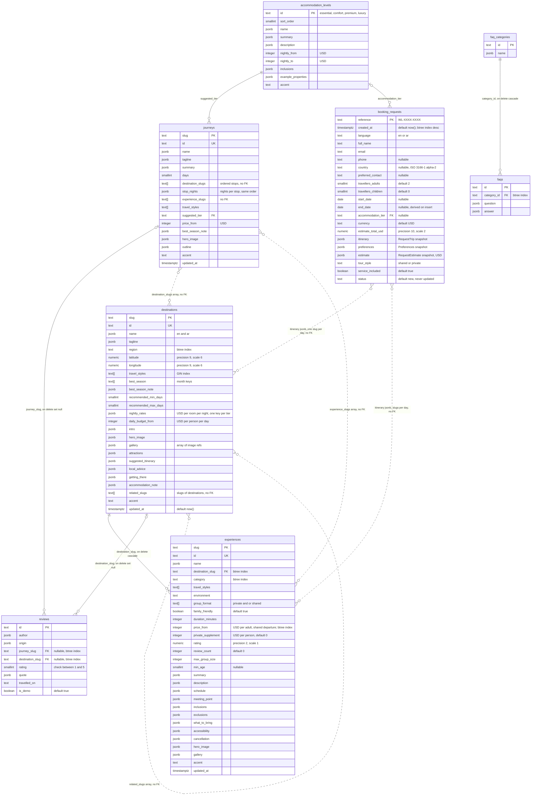
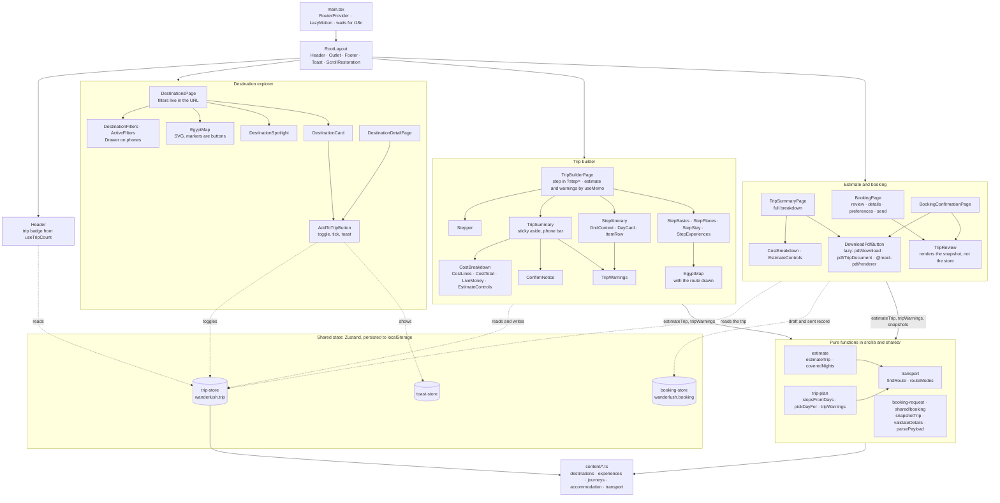
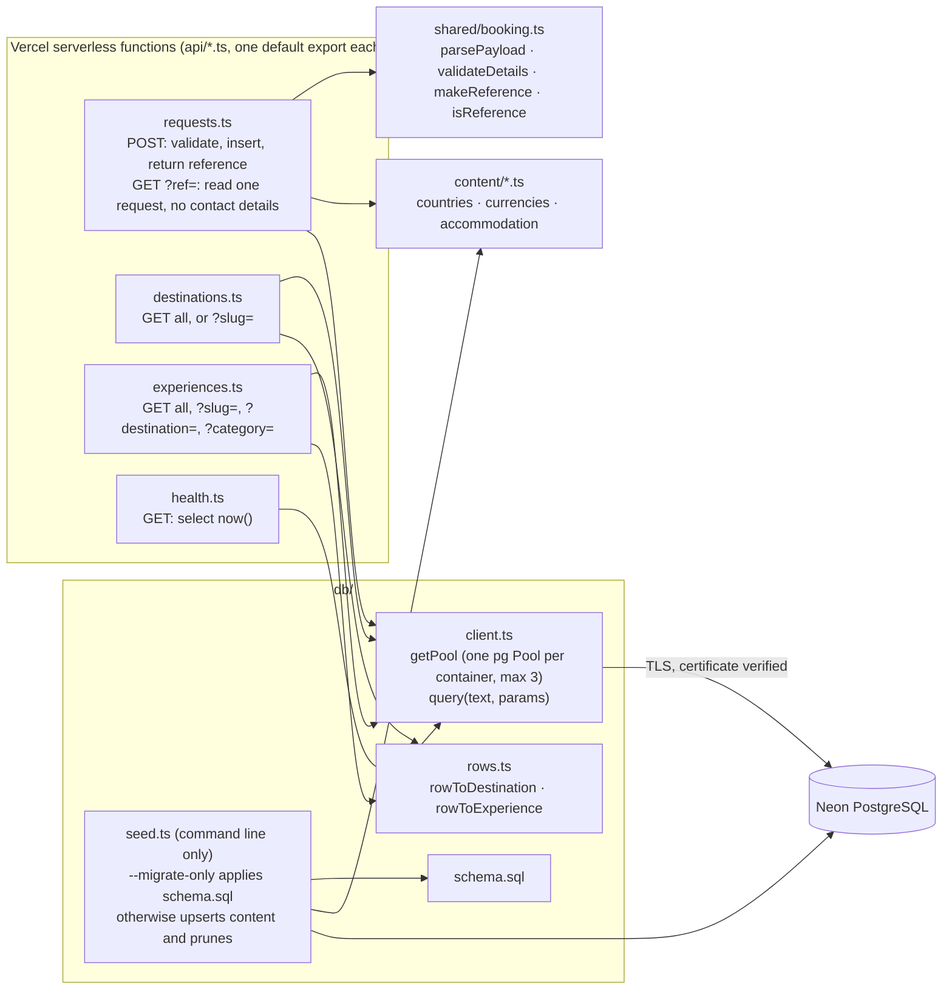
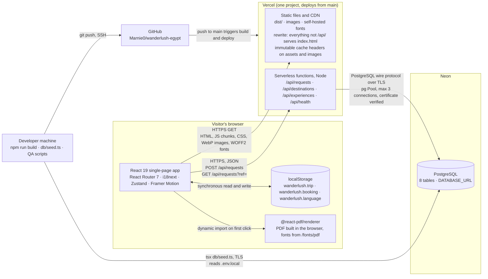
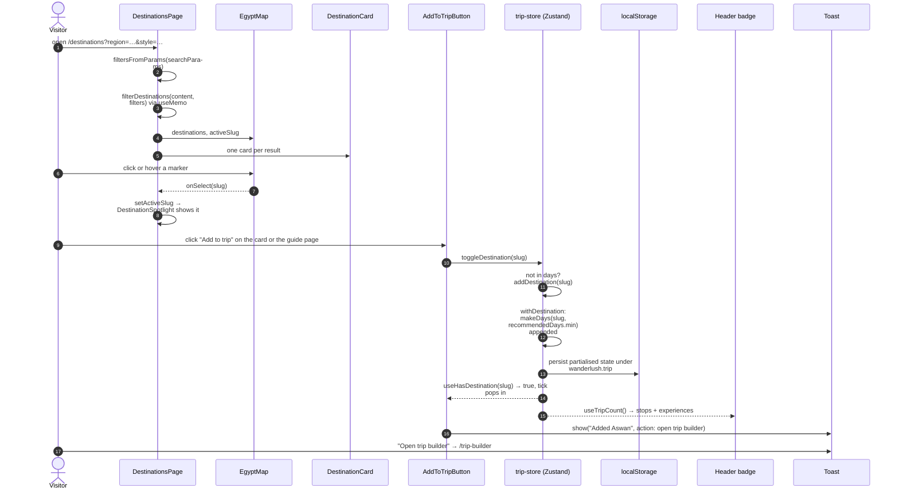
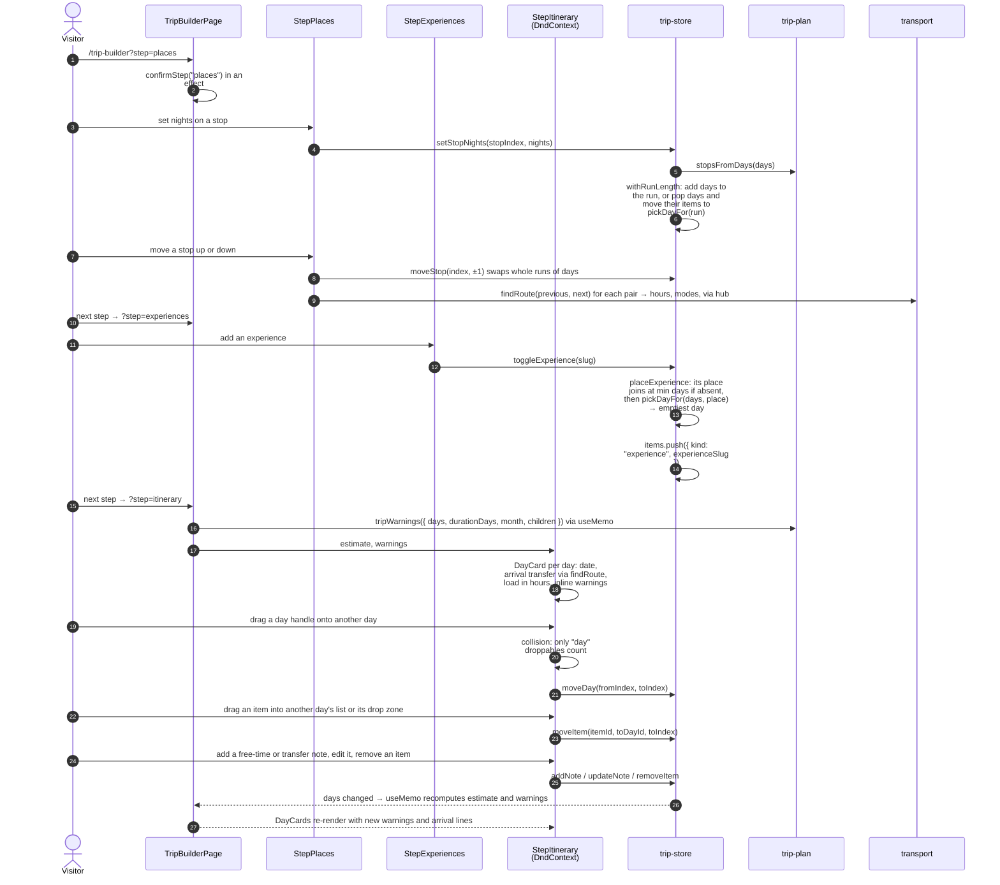
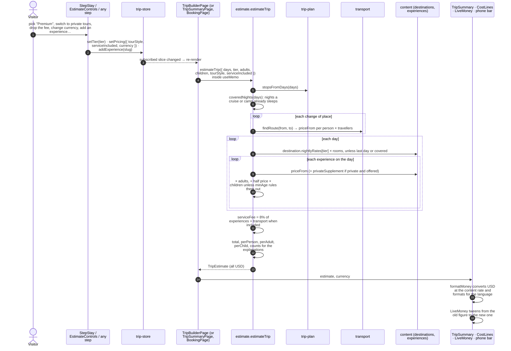
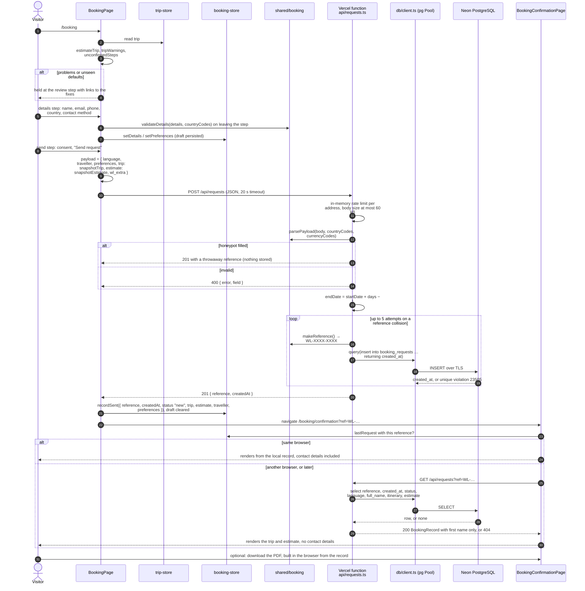
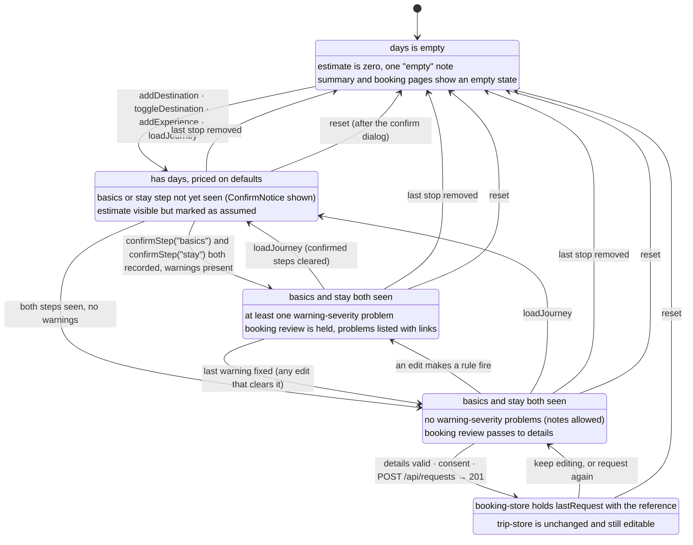

# Architecture

Five views of the site as it is built, drawn from the code and the live
database rather than from the brief. Every diagram is Mermaid, so GitHub
renders it in place. Where the code does not have the shape a diagram
usually assumes, the caption says so.

Read alongside `docs/pricing.md` (the estimate rules), `docs/booking.md`
(the request) and `docs/content-model.md` (what a destination or experience
carries).

## 1. Entity-relationship diagram

Eight tables in one Neon PostgreSQL database, verified against
`information_schema` on 10 September 2026. Localised text is stored as
`jsonb` of the shape `{"en": …, "ar": …}`; every filterable field is a real
column.

**What it shows.** Solid lines are real foreign keys; dotted lines are
relationships the application maintains without one. The catalogue tables
(`destinations`, `experiences`, `journeys`, `accommodation_levels`,
`reviews`, `faq_categories`, `faqs`) are a mirror of the TypeScript content
modules in `content/`, pushed by `db/seed.ts`, which upserts every row and
then deletes any row whose key is no longer in the content. The one table
the site writes to at runtime is `booking_requests`.

**Non-obvious choices.**

- **Slugs are the primary keys**, not the `id` columns. Every URL, every
  content lookup and every reference inside a trip uses the slug, so the
  key is the thing the rest of the system already holds. The `id` column is
  kept unique for the content model's sake.
- **A journey's stops are an array, not a join table.** A journey is an
  ordered list of places with nights per stop (`destination_slugs` and
  `stop_nights` are parallel arrays), and the same place can appear twice
  (Cairo first and last). A join table would need a position column and
  would still not enforce anything useful, because the content is authored
  in one place and validated there.
- **A booking request stores a snapshot, not references.** The `itinerary`
  column holds the days as sent (place, experience slugs, notes) and
  `estimate` holds the USD breakdown the traveller saw. Both are frozen on
  purpose: a price change in the content must not rewrite what someone was
  quoted. That is why there is no foreign key from a request to a place or
  an experience.
- **The only foreign key out of `booking_requests`** is the stay tier, and
  the API treats a violation there as a seeding fault, not a bad request,
  when the tier is one the content knows.
- **Indexes** exist for the filters the API exposes: region and travel
  styles on destinations (the styles index is GIN, for array containment),
  destination, category and price on experiences, and `created_at desc` on
  requests for a specialist's inbox.
- **`status` is a column without a lifecycle.** Every row is `new`; nothing
  in the code updates it. It is there so a back office could.

## 2. Component and module diagram

### 2a. Frontend

**What it shows.** Solid arrows are rendering (parent to child) or a plain
import of a function; dotted arrows are store subscriptions. The pages that
show a price (`TripBuilderPage`, `TripSummaryPage`, `BookingPage`) each
call the same two pure functions with the same inputs from the trip store:
`estimateTrip` for the money and `tripWarnings` for the problems. Neither
result is stored anywhere. They are recomputed by `useMemo` whenever the
trip changes, so there is exactly one source of truth (the store) and no
way for the sidebar, the phone bar and the booking review to disagree.

**Non-obvious choices.**

- **The itinerary is the trip.** The store holds `days[]`, each with a
  destination slug and a list of items. Places, nights per stop and chosen
  experiences are all derived from that list (`stopsFromDays`,
  `experienceSlugsInDays`), so the places step, the stay step and the
  itinerary editor are three views of one array rather than three lists
  that have to be reconciled.
- **Cards subscribe to one slug.** `AddToTripButton` uses selectors such as
  `useHasDestination(slug)`, so adding a place re-renders that button and
  the header badge, not every card on the page.
- **`TripReview` takes the snapshot**, the same `RequestTrip` object that is
  sent to the server, so the review on the form, the confirmation page and
  the PDF all show what was actually sent.
- **The PDF is a separate React tree.** `trip-pdf.ts` flattens the trip into
  plain strings first, because the document renders outside the app's
  providers and cannot translate or format anything itself. The renderer
  and the document are fetched only on the first click.
- **Nothing here is a class.** Components are functions, stores are Zustand
  hooks, logic modules export functions.

### 2b. Backend modules

**What it shows.** There is no service layer, no repository, no ORM and no
classes on the server. Each route is one file exporting one handler that
runs SQL through a shared `query` function. The only logic that is more
than a query is in `shared/booking.ts`, and it is shared with the browser
so that a request which passed the form also passes the API. **Two of the
four routes are unused by the site**: `/api/destinations` and
`/api/experiences` are live and answer from the database, but the React app
reads the same content from the bundled modules and never calls them. They
exist so the catalogue can be served from the database when a phase needs
it, and the end-to-end suite checks them.

## 3. System architecture

**What it shows.** Three hosted parts and one repository. The browser does
almost all of the work: content, search, filtering, the map, the trip, the
estimate, the warnings and the PDF are all computed on the client from the
bundled content modules. The server is reached twice in a whole visit at
most, both times for a booking request. Vercel serves the static build and
runs the four API files as functions from the same deployment. Neon holds
the database, reached only from those functions and from the seed script.

**Third-party services that are not there.**

- **No email provider.** A booking request is stored, and the traveller is
  shown a reference on a confirmation page. Nothing is sent to anyone.
  `docs/booking.md` records this as a deliberate limit of the demo.
- **No map tiles.** The map is an SVG drawn from `src/lib/egypt-geo.ts`.
- **No font or analytics CDN at runtime.** Fonts are self-hosted from
  `@fontsource` packages, subset by script. Google Fonts was used once, at
  build time, to fetch the static instances used inside the PDF.
- **No authentication and no back office.** The `status` column exists
  for one, but nothing reads or writes it.

**Environment.** One secret, `DATABASE_URL`, set in Vercel and in
`.env.local`. The pool strips `sslmode` from the string and sets its own
TLS options so the certificate is always verified. Rate limiting on
`/api/requests` is an in-memory map per function container (eight requests
per address per ten minutes), which the code itself describes as a brake
rather than a defence.

## 4. Sequence diagrams

### 4a. Selecting a destination and adding it to the trip

**What it shows.** Adding a place is a synchronous store update in the
browser; no request leaves the page. The place arrives as a run of days at
its shortest recommended stay, inserted after any existing days for the same
place or at the end of the route, and everything else the visitor sees (the
tick on the button, the badge in the header, the toast) is a subscription to
that one write. The same click on an already-added place removes every day
for it.

### 4b. Building and editing the day-by-day itinerary

**What it shows.** Every edit, whether from the places step, the experiences
step or a drag in the editor, is a store action that returns a new `days`
array; nothing in the editor keeps state of its own beyond which item is
being dragged. Warnings are not raised by the actions. They are computed
from the resulting days on the next render, so a fix made anywhere clears
the warning everywhere. Two rules do most of the placing: `pickDayFor` puts
a new experience on the emptiest day in its place, and a day taken away by
shortening a stop hands its items to the emptiest day that remains.

### 4c. The price estimate recalculating as the trip changes

**What it shows.** Pricing is one pure function with no network and no
stored result. The currency is not an input to it: every figure is USD until
the moment it is displayed, when `formatMoney` converts and formats, so a
currency change re-renders without re-estimating. The nightly rates come
from each destination, not from the tier, which is why the stay step can
show what Comfort against Premium costs for this particular route. The
figure on screen is the only thing that animates; the number underneath is
always the fresh one.

### 4d. Submitting a booking request end to end

**What it shows.** The whole journey touches the server twice, once to
write and once, only in another browser, to read. The same `parsePayload`
that the form relies on runs again on the server, so validation cannot drift
between the two. The reference is generated by the server and is the
primary key, so a collision is handled by drawing again rather than by a
sequence. The confirmation page prefers the copy kept in the browser,
which is the only place the traveller's contact details ever come back
from; the API deliberately returns the trip, the estimate and a first name,
nothing more. There is no email, no payment and no status change: the row
sits at `new` for a specialist to pick up.

## 5. State diagram for the trip

**What it shows.** The trip store persists only facts: the days, the party,
the dates, the tier, the pricing options, and which builder steps have been
seen. Every state above is derived from those facts on each render.

**Where this differs from the states the brief names.**

- **There is no "ready to price" state.** The estimate is computed on every
  render from the first day onwards, including in `Draft`. What changes when
  the basics and stay steps have been seen is only that the notice saying
  the figure rests on defaults goes away and the booking review stops
  holding the request.
- **"Validated" and "has conflicts" are not stored.** `tripWarnings` runs
  on every change and returns a fresh list. A rule of severity `warning`
  (over the trip length, a crowded day, the same experience twice, a busy
  day that starts with an eight-hour transfer, no route between two places)
  blocks the request; a `note` (under the trip length, a free transfer day,
  out of season, a minimum age, an overnight experience) does not. Because
  nothing is stored, there is no transition to write: the next render is the
  new state.
- **Sending does not end the trip.** The request is recorded in the booking
  store and the trip store is left alone, so the visitor can keep editing
  and send again; a second send creates a second row with a new reference.
  The only ways out are the reset dialog and removing every stop.
- **A journey resets the confirmation.** Loading a curated journey fills the
  days, the length and the suggested tier, then clears the seen steps, so
  a trip that arrived priced on someone else's defaults asks to be looked
  at before it can be requested.
- **The server has no state machine.** `booking_requests.status` is always
  `new`.
